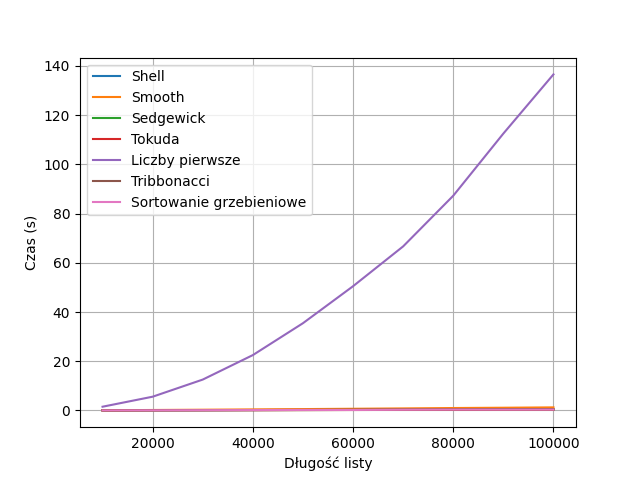
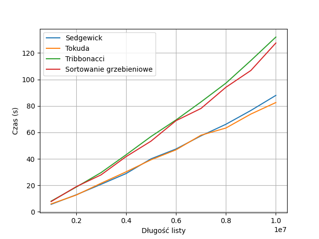

# Shell sort with different gap sequences


## (step 1)

I'll start with the basic InsertionSortStep algorithm that we prepared in class. In this example, I will work on **4096** numbers from **1** to **4095**.

```python
import random
import time
tab=[]

for n in range (4096):
    tab.append(random.randrange(1,4096))


start=time.time()
def InsertSortStep(tab,step):
    for i in range(1, len(tab)):
        a=tab[i]
        k=i-step
        while(a<tab[k] and k>=0):
            tab[k+step]=tab[k]
            k=k-step
        tab[k+step]=a
    return tab

InsertSortStep(tab,1)
stop=time.time()
print('Sorting time: ', stop-start)
#print(tab)
```


The time of sorting **4096** numbers only at step 1 is relatively short. In my case it amounted to exactly:

```python
Sorting time:  0.4817385673522949
```

However, the situation changes with more numbers.


## Code: 

```python
import time
import numpy as np
import matplotlib.pyplot as plt
import random
import math

def shell_generator():
    gap = len(a)//2
    k = 2
    while gap != 1:
        yield gap
        gap = gap/k
        # print(gap)
        gap = math.floor(gap)


def shell():
    shell = []
    for el in shell_generator():
        shell.append(el)
    shell.append(1)
    return shell


def threesmooth_generator():
    S = [1]
    i2 = 0
    i3 = 0
    while True:
        yield S[-1]
        n2 = 2 * S[i2]
        n3 = 3 * S[i3]
        S.append(min(n2, n3))
        i2 += n2 <= n3
        i3 += n2 >= n3


def smooth():
    smooth_inc = []
    smooth_dec = []
    for el in threesmooth_generator():
        # print(el)
        if el > len(a):
            break
        smooth_inc.append(el)

    for i in range(len(smooth_inc)-1, -1, -1):
        smooth_dec.append(smooth_inc[i])
    return smooth_dec


def sedgewick_generator():
    yield 1
    n = 0
    while True:
        yield pow(4, n+1)+3*pow(2, n)+1
        n = n+1


def sedgewick():
    sedgewick_inc = []
    sedgewick_dec = []
    for el in sedgewick_generator():
        if el > len(a):
            break
        sedgewick_inc.append(el)
        # print(el)

    for i in range(len(sedgewick_inc)-1, -1, -1):
        sedgewick_dec.append(sedgewick_inc[i])
    return sedgewick_dec


def tokuda_generator():
    yield 1
    n = 0
    while True:
        yield math.ceil((9 * (9/4)**n - 4) / 5)
        n = n+1


def tokuda():
    tokuda_inc = []
    tokuda_dec = []
    for el in tokuda_generator():
        if el > len(a):
            break
        tokuda_inc.append(el)

    for i in range(len(tokuda_inc)-1, -1, -1):
        tokuda_dec.append(tokuda_inc[i])
    return tokuda_dec


def prime_generator(N):
    for i in range(2, int(N**0.5)+1):
        if N % i == 0:
            return False
    return True


def prime():
    prime_inc = []
    prime_dec = []
    for i in range(2, len(a)):
        if prime_generator(i) == True:
            prime_inc.append(i)

    for i in range(len(prime_inc)-1, -1, -1):
        prime_dec.append(prime_inc[i])
    prime_dec.append(1)
    return prime_dec


def tribonacci_generator():
    yield 0
    yield 1
    yield 1
    seq = [0, 1, 1]
    while True:
        sum = seq[-1] + seq[-2] + seq[-3]
        yield sum
        seq.append(sum)
        # print(seq)


def tribonacci():
    tribonacci_inc = []
    tribonacci_dec = []
    for el in tribonacci_generator():
        # print(el)
        if el > len(a):
            break
        tribonacci_inc.append(el)

    for i in range(len(tribonacci_inc)-1, -1, -1):
        tribonacci_dec.append(tribonacci_inc[i])
    return tribonacci_dec


def InsertSortStep(tab, step):
    for i in range(1, len(tab)):
        a = tab[i]
        k = i-step
        while(a < tab[k] and k >= 0):
            tab[k+step] = tab[k]
            k = k-step
        tab[k+step] = a
    return tab


def comb_sort(arr, shrink):
    length = len(arr)
    gap = length
    sorted = False

    while not sorted:
        gap = int(gap/shrink)
        if gap <= 1:
            sorted = True
            gap = 1

        for i in range(length-gap):
            sm = gap + i
            if arr[i] > arr[sm]:
                arr[i], arr[sm] = arr[sm], arr[i]
                sorted = False


def comb():
    lista = []
    lista.append(1.3)
    return lista


def isSorted(l):
    i = 1
    while i < len(l):
        if l[i] < l[i-1]:
            return False
        i = i+1
    return True


sorts = [
    {
        "name": "Shell",
        "sort": lambda arr: InsertSortStep(arr, gap),
        "gap": shell
    },

    {
        "name": "Smooth",
        "sort": lambda arr: InsertSortStep(arr, gap),
        "gap": smooth
    },
    {
        "name": "Sedgewick",
        "sort": lambda arr: InsertSortStep(arr, gap),
        "gap": sedgewick
    },
    {
        "name": "Tokuda",
        "sort": lambda arr: InsertSortStep(arr, gap),
        "gap": tokuda
    },
    {
        "name": "Liczby pierwsze",
        "sort": lambda arr: InsertSortStep(arr, gap),
        "gap": prime
    },
    {
        "name": "Tribonacci",
        "sort": lambda arr: InsertSortStep(arr, gap),
        "gap": tribonacci
    },
    {
        "name": "Sortowanie grzebieniowe",
        "sort": lambda arr: comb_sort(arr, gap),
        "gap": comb
    }
]


k_thousands = 100

elements = np.array([i*k_thousands*100 for i in range(1, 11)])
plt.xlabel('List length')
plt.ylabel('Time (s)')

for sort in sorts:
    # print(sort)
    times = list()
    start_all = time.time()
    for i in range(1, 11):
        a = []
        for n in range(i*k_thousands*100):
            a.append(random.randrange(1, i*k_thousands*100))
        gaps = sort["gap"]()
        print(gaps)
        start = time.time()
        for gap in gaps:
            sort["sort"](a)
        end = time.time()
        times.append(end - start)
        # print(times)
        print(sort["name"], "Sorted", i*k_thousands*100, "Elements in", end - start, "s")
        end_all = time.time()
        print(sort["name"], "Sorted Elements in", end_all - start_all, "s")

        isSorted(a)
        if isSorted(a) == True:
            print("Sorted")
        else:
            print("Not sorted")
            print(a)
            break

    # print(tab)
    plt.plot(elements, times, label=sort["name"])

plt.grid()
plt.legend()
plt.show()
```

For each type of step, I prepared two functions. One is a generator that generates numbers according to a given pattern. The other controls how many of these numbers are generated so as not to overcrowd the list, and additionally inverts it so that it is in descending order.


## Shell (Shell, 1959)

General formula:  


Next gaps: 


Complexity in worst case: 

Example sequence (for 4096):

[4197377, 1050113, 262913, 65921, 16577, 4193, 1073, 281, 77, 23, 8, 1]

```python
def shell_generator():
    gap = len(a)//2
    k = 2
    while gap != 1:
        yield gap
        gap = gap/k
        # print(gap)
        gap = math.floor(gap)


def shell():
    shell = []
    for el in shell_generator():
        shell.append(el)
    shell.append(1)
    return shell
```

Sorting **4096** numbers:
```python
Sorting time:  0.02992105484008789
```


Chart for sorting **100 thousand** items:


## 3-smooth numbers (Pratt, 1971)

General formula:  


Next gaps: 


Complexity in worst case: 

Example sequence:

[3888, 3456, 3072, 2916, 2592, 2304, 2187, 2048, 1944, 1728, 1536, 1458, 1296, 1152, 1024, 972, 864, 768, 729, 648, 576, 512, 486, 432, 384, 324, 288, 256, 243, 216, 192, 162, 144, 128, 108, 96, 81, 72, 64, 54, 48, 36, 32, 27, 24, 18, 16, 12, 9, 8, 6, 4, 3, 2, 1]

```python
def threesmooth_generator():
    S = [1]
    i2 = 0
    i3 = 0
    while True:
        yield S[-1]
        n2 = 2 * S[i2]
        n3 = 3 * S[i3]
        S.append(min(n2, n3))
        i2 += n2 <= n3
        i3 += n2 >= n3


def smooth():
    smooth_inc = []
    smooth_dec = []
    for el in threesmooth_generator():
        # print(el)
        if el > len(a):
            break
        smooth_inc.append(el)

    for i in range(len(smooth_inc)-1, -1, -1):
        smooth_dec.append(smooth_inc[i])
    return smooth_dec
```

Sorting **4096** numbers:

```python
Sorting time:  0.02991938591003418
```

Chart for sorting **100,000** items:


## Sedgewick formula (Sedgewick, 1982)
General formula: 

Next gaps:

Complexity in worst case:

Example sequence:

[4197377, 1050113, 262913, 65921, 16577, 4193, 1073, 281, 77, 23, 8, 1]

```python
def sedgewick_generator():
    yield 1
    n = 0
    while True:
        yield pow(4, n+1)+3*pow(2, n)+1
        n = n+1


def sedgewick():
    sedgewick_inc = []
    sedgewick_dec = []
    for el in sedgewick_generator():
        if el > len(a):
            break
        sedgewick_inc.append(el)
        # print(el)

    for i in range(len(sedgewick_inc)-1, -1, -1):
        sedgewick_dec.append(sedgewick_inc[i])
    return sedgewick_dec
```


Sorting **4096** numbers:

```python
Sorting time:  0.009998083114624023
```

Chart for sorting **100,000** items:


### Tokuda (N.Tokuda, 1992)
General formula:

Next gaps:

Complexity in worst case: Unknown

Example sequence:

[8845866, 3931496, 1747331, 776591, 345152, 153401, 68178, 30301, 13467, 5985, 2660, 1182, 525, 233, 103, 46, 20, 9, 4, 1, 1]

```python
def tokuda_generator():
    yield 1
    n = 0
    while True:
        yield math.ceil((9 * (9/4)**n - 4) / 5)
        n = n+1


def tokuda():
    tokuda_inc = []
    tokuda_dec = []
    for el in tokuda_generator():
        if el > len(a):
            break
        tokuda_inc.append(el)

    for i in range(len(tokuda_inc)-1, -1, -1):
        tokuda_dec.append(tokuda_inc[i])
    return tokuda_dec
```

Sorting **4096** numbers:

```python
Sorting time:  0.009011268615722656
```

Chart for sorting **100,000** items:


## My chosen gaps

### Prime numbers

General formula: Unknown

Next gaps: 1, 2, 3, 4, 5, 7, 8, 9, 11, 13, 16, 17, 19, ...

Complexity in worst case: Unknown

Example sequence:

[103, 101, 97, 89, 83, 79, 73, 71, 67, 61, 59, 53, 47, 43, 41, 37, 31, 29, 23, 19, 17, 13, 11, 7, 5, 3, 2, 1]

```python
def prime_generator(N):
    for i in range(2, int(N**0.5)+1):
        if N % i == 0:
            return False
    return True


def prime():
    prime_inc = []
    prime_dec = []
    for i in range(2, len(a)):
        if prime_generator(i) == True:
            prime_inc.append(i)

    for i in range(len(prime_inc)-1, -1, -1):
        prime_dec.append(prime_inc[i])
    prime_dec.append(1)
    return prime_dec
```


Sorting **4096** numbers:

```python
Sorting time:  0.28923654556274414
```

Chart for sorting **100,000** items:


## Tribonacci sequence

General formula:

Next gaps: 0, 1, 1, 2, 4, 7, 13, 24, 44, 81, ...

Complexity in worst case: Unknown

Example sequence:

[8646064, 4700770, 2555757, 1389537, 755476, 410744, 223317, 121415, 66012, 35890, 19513, 10609, 5768, 3136, 1705, 927, 504, 274, 149, 81, 44, 24, 13, 7, 4, 2, 1, 1, 0]


```python
def tribonacci_generator():
    yield 0
    yield 1
    yield 1
    seq = [0, 1, 1]
    while True:
        sum = seq[-1] + seq[-2] + seq[-3]
        yield sum
        seq.append(sum)
        # print(seq)


def tribonacci():
    tribonacci_inc = []
    tribonacci_dec = []
    for el in tribonacci_generator():
        # print(el)
        if el > len(a):
            break
        tribonacci_inc.append(el)

    for i in range(len(tribonacci_inc)-1, -1, -1):
        tribonacci_dec.append(tribonacci_inc[i])
    return tribonacci_dec

```

Sorting **4096** numbers:

```python
Sorting time:  0.012966156005859375
```


## Some general charts


### Sorting time for 10 000 numbers

As you can see, the sequence of prime numbers I chose is very different from the rest.


---


### Sorting time for 100,000 numbers



A sequence of prime numbers slows down the code a lot so I will test larger numbers without it.

---


### Sorting time for 100,000 numbers (not included sequence of prime numbers)


The 3-smooth numbers method also begins to slow down on such numbers.


### Sorting time for 1 million numbers (not included sequence of prime numbers)


### Sorting time for 10 million numbers  (not included Shell's , Smooth's, prime numbers)





## Comb sorting 

This sorting is mainly an improvement of bubble sorting. In bubble sorting, the method of operation is to check adjacent elements. And in comb sorting, we increase the step by more than 1. We start with a large step and "go down" by a factor of 1.3, so until the step reaches 1. In this way, comb sorting reduces the number of comparisons.  The factor of 1.3 by which we reduce the step was discovered by testing 200,000 random lists. This sorting is on average better than bubble sort, but the worst case still remains with O(n^2) complexity.

The workaround is to eliminate extreme values from the end of the list, because through them Bubble Sort slows down drastically. 


The general code looks like this:

```python
def comb_sort(arr, shrink):
    length = len(arr)
    gap = length
    sorted = False

    while not sorted:
        gap = int(gap/shrink)
        if gap <= 1:
            sorted = True
            gap = 1

        for i in range(length-gap):
            sm = gap + i
            if arr[i] > arr[sm]:
                arr[i], arr[sm] = arr[sm], arr[i]
                sorted = False

...
...

def comb():
    lista = []
    lista.append(1.3)
    return lista
```

In order to make my dictionary program work, I had to use such a trick :)


```python
Sorting time:  0.009949445724487305
```


In addition, with each of these methods, I used a script to check whether the array was actually sorted. The check had no effect on timing.


```python
def isSorted(l):
    i = 1
    while i < len(l):
        if l[i] < l[i-1]:
            return False
        i = i+1
    return True
    
...
...

isSorted(a)
if isSorted(a) == True:
	print("Sorted")
else:
	print("Not sorted")
	print(a)
	break
```


Mateusz Suszczyk